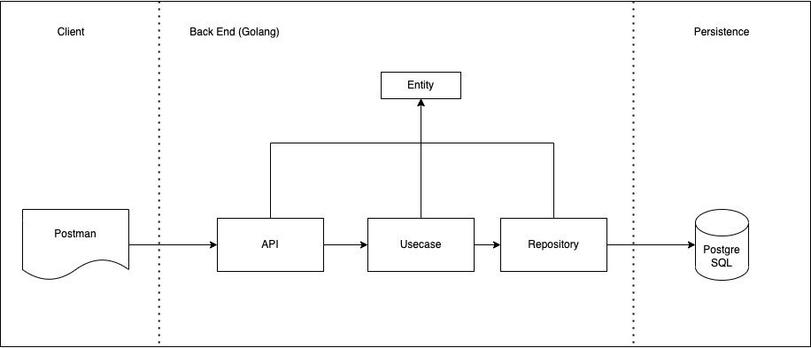

# Wallet App

A mock wallet app that satisfy [this](https://documenter.getpostman.com/view/8411283/SVfMSqA3?version=latest) requirement

## Technologies Used
- Go programming language
- PostgreSQL

## Installation
### Prerequisites
- Go programming language
- Docker

### 1. Install Docker
- To install docker, simply just install the docker desktop app. It will install everything you need. You can download from [here](https://www.docker.com/products/docker-desktop/)

### 2. Run docker containers
I've already create a docker-compose.yml to install postgres to your docker. Run `docker-compose up` to compose the docker.

### 3. Setup DB - Soda commands

There are several commands that you can use and see the detail [here](https://gobuffalo.io/documentation/database/migrations/). But for summary, you only need to migrate the db:

- `soda migrate` or `soda migrate up` -> Run your database migration

The migration files are under `walletapp/migrations`

### 4. Run Server

You can run the server using these commands:
- `go run app/http/app.go` -> Run HTTP Server

## Flow

